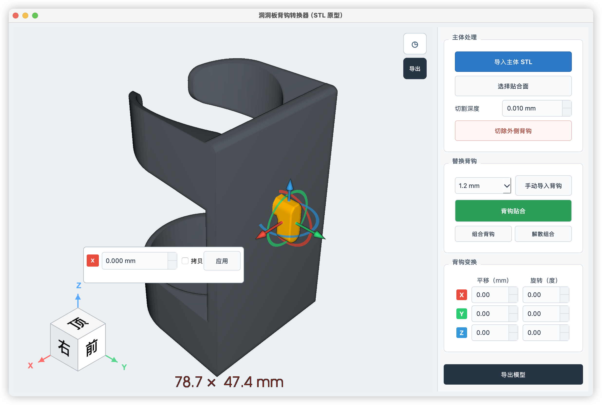

# PegHook Studio

洞洞板背钩转换器。PegHook Studio 面向使用宜家洞洞板或类似孔板系统的 3D 打印用户，解决模型主体结构很好、但原模型背钩厚度与自己的洞洞板不匹配的问题。

## 它解决什么问题

洞洞板背钩存在不同厚度和形状规格。很多现成模型的主体值得直接使用，但背钩可能是 5 mm，而用户实际需要 1.2 mm；或者模型的背钩方向、位置不适合自己的孔板。

传统做法需要在 CAD 软件中反复导入、切面、删除旧背钩、修补切口、导入新背钩，再手动对齐。这些步骤对只想打印一个实用配件的用户来说非常耗时。

PegHook Studio 将这个过程集中到一个 3D 工作台中：选择主体贴合面，切除外侧旧背钩，载入合适的新背钩并自动贴合，然后进行精确移动、旋转和导出。

当前内置 1.2 mm 和 5 mm 背钩，同时支持用户手动导入其他厚度、其他形状的 STL 或 STEP 背钩。

## 界面预览

下面的截图来自当前开发版本，用于展示工作台和背钩操纵器的交互布局。实际界面会随版本继续调整。



## 当前功能

- 导入主体 STL。
- 导入 STL 背钩，或选择内置 1.2 mm / 5 mm 背钩。
- 支持用户手动导入其他厚度的背钩模型。
- 选择主体上的贴合面，并将选择作为一次性操作处理。
- 按选定平面切除主体外侧背钩，尽量保留较大的主体部分。
- 新背钩自动贴合到选定面。
- 背钩直接点击选择、平移、旋转、复制和删除。
- X/Y/Z 轴颜色标识、数值输入、键盘上下调整和鼠标操纵器。
- Shift/Cmd 多选背钩，组合和解散组合，组合后整体变换。
- 操作历史、撤销和重做。
- 支持标准视图和方向立方体。
- 导出合并后的 STL 模型。

### 文件格式说明

STL 是当前最稳定、最主要的工作格式。STEP 通过 OpenCascade 三角化后参与网格处理，需要额外安装 `cadquery-ocp`；不同 STEP 文件的拓扑结构和曲面复杂度可能影响转换结果。3MF 当前不在支持范围内。

## 使用流程

1. 导入主体 STL。
2. 点击“选择贴合面”，在主体背面或旧背钩与主体的交界平面上点击。
3. 需要去除旧背钩时，在“切割深度”中输入数值，然后点击“切除外侧背钩”。
4. 在“替换背钩”中选择内置 1.2 mm / 5 mm 背钩，或手动导入自己的模型。
5. 点击“背钩贴合”，让新背钩自动贴到已选择的面。
6. 点击背钩进行平移、旋转、复制或多选组合；也可以在右侧变换区域输入精确数值。
7. 点击“导出模型”，生成合并后的 STL。

## 从源码在本地运行

建议使用 Python 3.11（当前依赖组合和 PySide6/VTK 在此版本上验证最充分）。Python 3.12 和 3.13 通常也可以运行，但需要重新安装依赖并自行处理个别兼容性差异。Python 3.14 发布较新，部分科学计算和三维依赖可能尚未提供对应轮子；如果使用 3.14 安装失败，请优先改用 3.11，而不是混用不同 Python 版本的虚拟环境。无论选择哪个版本，都应为项目创建独立虚拟环境。

先进入项目目录：

### macOS

```bash
python3.11 -m venv .venv
source .venv/bin/activate
python -m pip install --upgrade pip
python -m pip install -r requirements.txt
python pegboard_converter.py
```

### Windows PowerShell

```powershell
py -3.11 -m venv .venv
.\.venv\Scripts\Activate.ps1
python -m pip install --upgrade pip
python -m pip install -r requirements.txt
python pegboard_converter.py
```

STEP 支持需要额外安装：

```bash
python -m pip install cadquery-ocp
```

如果只处理 STL，可以不安装 STEP 依赖。

## 使用 AI 协助部署和排错

可以把本项目 README、`requirements.txt`、操作系统版本、Python 版本、执行命令和完整错误日志一起提供给豆包、DeepSeek、ChatGPT 或其他编程 AI。不要只发送一句“运行不了”，模型需要上下文才能判断是依赖、Qt 插件、VTK、文件路径还是模型处理问题。

推荐提问模板：

```text
我正在部署 PegHook Studio。
操作系统和芯片：
Python 版本：
执行的命令：
完整错误日志：
我期望的结果：

请先判断问题属于依赖安装、Qt 平台插件、VTK 渲染、资源路径还是 STL/STEP 处理，
然后给出最小修改方案。不要重写整个项目，也不要删除现有功能。
```

常见问题的提问方式：

- `ModuleNotFoundError`：提供完整模块名和 `pip show 模块名` 的结果。
- Qt platform plugin 加载失败：提供系统版本、Python 环境路径和完整 Qt 错误。
- VTK 窗口空白或闪退：提供芯片型号、显卡驱动、是否远程桌面运行以及终端日志。
- 内置背钩找不到：提供项目目录结构和 `preset_hooks` 文件列表。
- STEP 导入失败：提供 STEP 文件来源、文件大小、错误日志；不要只截最后一行。
- PyInstaller 打包后资源丢失：提供 `.spec` 文件、打包命令和程序启动日志。

AI 给出修改建议后，建议先让它解释原因，再让它只修改相关文件，并保留一份可回退的备份。

## 打包和发布规划

源码仓库不包含 `.venv` 和完整运行环境。正式发布时建议使用 PyInstaller 在目标平台分别构建：

- macOS arm64（Apple Silicon）。
- macOS x86_64（Intel）。
- Windows x64（Intel 和 AMD CPU 共用一个版本）。

第一版优先使用 one-folder 包，便于处理 Qt、VTK、OpenGL 和资源文件。后续可以制作 5～15 MB 的原生下载器：下载器检测平台，读取带有大小、地址和 SHA-256 的清单，按组件下载运行环境，显示分项进度和总进度，校验解压后再启动主程序。

国内用户不应依赖首次启动时从 PyPI 安装环境。正式下载器应使用国内 OSS/CDN 作为主源，并提供备用镜像、断点续传、失败重试和完整离线安装包。GitHub Releases 可作为公开版本记录和海外下载源。

## 项目状态和限制

这是一个持续迭代中的桌面工具。当前重点是 STL 网格转换和背钩贴合；复杂、破损或非流形网格可能需要先在其他网格工具中修复。切割采用用户选择平面与网格几何计算，不承诺对所有模型自动识别出语义上的“旧背钩”。

后续方向包括更稳健的网格修复、区域切割、批量处理、更多背钩资源和跨平台安装器。

## 许可证

本项目代码使用 MIT License。第三方依赖遵循各自许可证；发布应用时应同时保留 Qt/PySide6、VTK、NumPy、SciPy、trimesh 等依赖的许可证和 notices。
